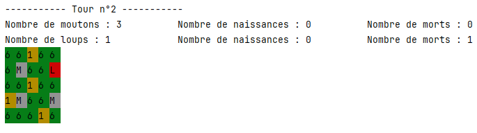

  <h3 align="center">Ecosystème</h3>

  

    Voici tout ce que vous devez savoir sur le projet de l'Ecosystème.
     
  

  
Tables des matières

  <ol>
    <li>
      <a href="#a-propos-du-projet">A propos du projet</a>
    </li>
    <li><a href="#Comment-marche-le-jeu-?">Notice</a></li>
    <li><a href="#Affichage">Affichage</a></li>
    <li><a href="#Choix">Choix</a></li>
     <li><a href="#Fonctionnalité">Fonctionnalité</a></li>
    <li><a href="#Conclusion">Conclusion</a></li>
  </ol>

## A propos du projet

Vous avez là un projet d'écosystème. Ce programme a pour but de simuler une prairie découpée en carrés d'herbe. Des moutons s'y déplacent, broutent et se déplacent librement dans la prairie. Lorsqu'ils rencontrent un ami mouton, un petit mouton apparaît pour vivre à son tour. Mais les loups aussi sont de la partie, ils se déplacent afin de trouver de quoi se nourrir. Les moutons ont donc intérêt à bien se tenir.

Le but de ce devoir était de s'expérimenter sur la programmation en Python avec des classes et différentes entités (moutons et loups). Mais aussi d'intégrer plusieurs petites fonctionnalités, telles que la croissance de l'herbe ou la gestion de la nourriture des animaux. 

## Comment marche le jeu ? 

Vous allez pouvoir lancer le code et changer les paramètres suivants de la simulation, si vous le souhaitez. Sinon, la simulation se lancera avec des paramètres choisis à l'avance.

 * Durée de repousse de l'herbe
 * Hauteur maximale de l'herbe
 * Taille de la prairie (L x L)
 * Le nombre de moutons
 * Le nombre de loups
 * Et leurs statistiques

Après avoir rempli vos paramètres personnalisés, la prairie va être générée avec l'herbe, les moutons et les loups. Chaque tour, la prairie va être mise à jour :

 * L'herbe pousse d'un cran.
 * Les moutons pourront se déplacer librement dans la prairie pour brouter l'herbe si elle est assez grande.
 * Ils pourront se reproduire si deux moutons sont sur la même case.
 * Les loups pourront chasser les moutons pour se nourrir et se reproduire. S'ils ne mangent pas assez, ils peuvent mourir de faim.

Tout se déroule dans l'interpréteur, dans la console.

## Affichage

Légende :
Vous pouvez remarquer que la prairie est constitué de carrer d'herbe avec un nombre et une couleur, elle indique la taille de l'herbe et si elle consumable par les moutons.
Les moutons sont représenté par des "M" et les loups par des "L".
Vous pouvez voir l'état de la population de mouton et de loup de la prairie.

## Choix

J'ai choisi de découper le projet en plusieurs classes pour une meilleure lisibilité du code. J'ai donc créé :

 * Une classe Prairie qui contient les moutons et les loups.
 * Une classe Animal qui hérite de la classe Prairie et qui est donc commune aux moutons et aux loups.
 * Une classe Herbe qui n'a pas de lien direct avec les moutons et les loups et qui pourrait être gérée différemment.

Chaque classe a ses propres méthodes et attributs pour une meilleure gestion des entités. Cela rend le code plus lisible et plus facile à comprendre.

Les programmes sont divisés en plusieurs fichiers pour une meilleure gestion des classes et des fonctions. Je les ai rangés dans des dossiers pour une meilleure organisation.

## Fonctionnalité

Cette simulation gère les entités par rapport à leur nourriture et leur position. Chaque entité cherche à survivre en cherchant à manger à chaque tour et se déplace dans cet environnement restreint. L'herbe pousse et suit une croissance continue.

L'ensemble du programme est codé en Python 3.9.6. J'ai utilisé les bibliothèques suivantes : random, time, os et sys.

## Conclusion
Ce projet m'a permis de m'expérimenter sur la programmation en Python avec des classes et différentes entités (moutons et loups). J'ai également pu intégrer plusieurs petites fonctionnalités, telles que la croissance de l'herbe ou la gestion de la nourriture des animaux. Cela m'a permis d'améliorer mes compétences en programmation et en algorithmique.

Ce projet nous a montré l'envergure du développement d'un projet conséquent et les multiples améliorations possibles, telles que l'affichage avec des dessins en 2D, et la création de graphiques pour visualiser l'évolution des populations et des événements importants, comme la première naissance.
